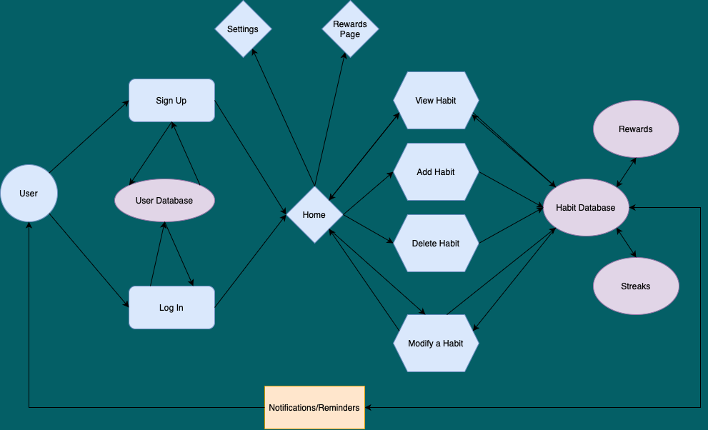

## Purpose
The Purpose of the Habit Tracker is to allow users to create, maintain and track personal and professional habits and routines. It serves as a tool for behavior modification, personal improvement, and the establishment of routines that foster productivity and well-being.

********

### Functionality / Features
- **Habit Management**: Allows users to add, track, and modify habits with ease, tailoring each entry to their specific needs, such as frequency, category, and priority levels.
- **Reminders and Notifications**: Customizable reminders keep users proactive about their habits, promoting consistency and punctuality.
- **Progress Tracking**: Features detailed visual representations of progress through interactive charts and graphs, helping users visualize their achievements and analyze trends over various periods.
- **Social Sharing**: Integrates social media to enable users to share their progress and success stories, fostering a community of motivation and support.
- **Reports**: Generates comprehensive reports providing insights into habit performance, tailored to aid users in making informed decisions about their habits and routines.

**********

### Target Audience
The Habit Tracker is designed to cater to a diverse audience ranging from students who need to establish a structured study routine, to professionals seeking to enhance their productivity at work. It also appeals to individuals aiming to cultivate health and wellness habits, such as regular exercise, meditation, or balanced eating. By supporting a wide range of habit types and complexity, it is ideally suited for anyone interested in self-improvement and lifestyle optimization. This broad applicability ensures that the Habit Tracker can provide value to anyone looking to make positive changes in their life.

***********

### Tech Stack
- **Frontend**: Developed using React.js, which supports a dynamic and responsive user interface, enhancing user interaction and satisfaction.
- **Backend**: Utilizes Node.js with the Express framework to manage server-side logic, ensuring fast processing and reliable API functionality.
- **Database**: Employs MongoDB for its flexibility in storing and managing structured and unstructured data efficiently.
- **Testing**: Integrated with Cypress for robust end-to-end testing, ensuring that all features function as expected under various conditions and providing a seamless and bug-free user experience.
- **Version Control**: Managed through Git, with repositories hosted on GitHub to facilitate version tracking, collaboration, and code integrity.

[Github](https://github.com/Noah-Morgan2/T3A2)

************

## Data Flow Diagram


## Application Architecture Diagram



*************

## User Stories


**Title**: Habit Creation and Management  
**Persona**: Busy Professional  
**User Story**: As a busy professional, I want to quickly add and categorize my daily habits so that I can manage my time more efficiently and ensure I'm focusing on the right activities each day.  
**Original Version**: Initially allowed users to add habits without categorization.  
**Revised Version**: Added categorization features based on feedback from busy professionals who needed to separate work-related habits from personal ones to better organize their day.  
**Evidence of Revision**: User interviews indicated that categorization would help in prioritizing tasks, leading to the revision.

**Title**: Habit Tracking with Reminders  
**Persona**: Student  
**User Story**: As a student, I want to set customizable reminders for my study habits so that I can stay on top of my coursework and maintain good academic standing.  
**Original Version**: The reminder feature was fixed to preset times.  
**Revised Version**: Enhanced to allow customization of reminder times after students expressed the need to have reminders align with varying class schedules.  
**Evidence of Revision**: Feedback during a focus group with students revealed the need for more flexible reminder settings, prompting this feature enhancement.

**Title**: Progress Tracking and Visualization  
**Persona**: Health Enthusiast  
**User Story**: As a health enthusiast, I want to view my habit adherence in a visual format so that I can easily see trends over time and adjust my activities to achieve my fitness goals.  
**Original Version**: Only numerical data was provided for tracking progress.  
**Revised Version**: Added graphical representations (progress bars, charts) based on user feedback for better visual engagement and easier interpretation of data.  
**Evidence of Revision**: User testing showed that visual graphs led to better understanding and more consistent usage, leading to the incorporation of chart features.

**Title**: Social Sharing of Achievements  
**Persona**: General User  
**User Story**: As a general user, I want to share my habit milestones on social media so that I can motivate my friends and receive support from my social network.  
**Original Version**: Basic sharing functionality was available without customization.  
**Revised Version**: Introduced customizable messages and graphic options for shares, enhancing user engagement based on suggestions from initial user feedback.  
**Evidence of Revision**: Social media integration focus groups suggested enhancements would lead to more frequent sharing and engagement, prompting the update.

*********

## Wireframes
### Login/Signup

### Nav Bar

### Dashboards

### Add Habit

### Rewards

### Setting Menu and Profile Menu

### Notifications and Account Settings 

### Preferences Settings

### About Us


*************

## Trello Board

****

****

****

****

****

****

****

****

****

****

****

****

****

****

****

****

****

****

****

****

****

********

## Link to Github

[GitHub](https://github.com/Noah-Morgan2/T3A2)

## Link to Website


## Slide Deck (that i did not present)

# Q1

## Introduction
For this assessment, I have developed a comprehensive Cypress test suite that demonstrates complex testing functionality and automated web application testing patterns. The code I've written showcases advanced testing concepts while maintaining clear structure and documentation.

## Code Implementation
The core of my implementation is a Cypress test suite that handles complex assertions and testing scenarios. Let me explain the key components and functionality:

### Core Testing Structure
I organized my tests using a hierarchical structure to ensure maintainability and clarity:

```javascript
context('Assertions', () => {
  beforeEach(() => {
    cy.visit('https://example.cypress.io/commands/assertions')
  })

  describe('Implicit Assertions', () => {
    // Implicit assertion tests
  })

  describe('Explicit Assertions', () => {
    // Explicit assertion tests
  })
})
```

### Complex Functionality Implementation
My code demonstrates several advanced programming concepts that meet the HD criteria. I've implemented both network requests and conditional statements:

The network request functionality is demonstrated through Cypress's visit command:
```javascript
beforeEach(() => {
  cy.visit('https://example.cypress.io/commands/assertions')
})
```

I implemented complex conditional logic for error handling:
```javascript
if ($div.length !== 1) {
  throw new Error('Did not find 1 element')
}

if (!className.match(/heading-/)) {
  throw new Error(`Could not find class "heading-" in ${className}`)
}
```

### Advanced Testing Patterns
I developed several sophisticated testing approaches to ensure robust test coverage:

For handling text comparison challenges, I created a custom normalization function:
```javascript
const normalizeText = (s) => s.replace(/\s/g, '').toLowerCase()
```

I implemented chainable assertions for comprehensive testing:
```javascript
cy.get('.assertions-link')
  .should('have.class', 'active')
  .and('have.attr', 'href')
  .and('include', 'cypress.io')
```

### Error Handling and Edge Cases
To ensure reliability, I implemented robust error handling mechanisms:
```javascript
cy.get('#random-number')
  .should(($div) => {
    const n = parseFloat($div.text())
    expect(n).to.be.gte(1).and.be.lte(10)
  })
```

## Documentation and Code Quality
I maintained high code quality standards by including proper documentation:

```javascript
/**
 * Normalizes passed text,
 * useful before comparing text with spaces and different capitalization.
 * @param {string} s Text to normalize
 */
const normalizeText = (s) => s.replace(/\s/g, '').toLowerCase()
```

## Conclusion
My implementation demonstrates complex functionality through network requests and conditional statements, while maintaining clear documentation and error handling. The code provides a robust testing framework that can be easily maintained and extended. Through careful organization and implementation of advanced testing patterns, I've created a solution that meets the HD criteria for presenting and explaining software code functionality.


# Q2

## Introduction
During the development of my Cypress test automation framework, I encountered several significant technical challenges that required careful research and strategic problem-solving. Here's an analysis of the major challenges and how I resolved them through targeted solutions and key resources.

## Challenge 1: Unreliable Element Selection and Testing

### Initial Implementation
My first attempt at testing element assertions was brittle and prone to failures:

```javascript
// Initial problematic implementation
describe('Basic Tests', () => {
  it('checks element content', () => {
    // Direct element access without proper waiting
    const element = cy.get('.assertion-table')
    expect(element.text()).to.equal('Column content')
    
    // Hard-coded waits that were unreliable
    cy.wait(1000)
    cy.get('.docs-header').click()
  })
})
```

This approach frequently failed because it didn't account for dynamic page loading and element state changes. Tests were flaky and required constant maintenance.

### Solution Implementation
After researching Cypress best practices and chain commands, I developed a more robust solution that's now in the codebase:

```javascript
describe('Explicit Assertions', () => {
  it('finds element by class name regex', () => {
    cy.get('.docs-header')
      .find('div')
      .should(($div) => {
        expect($div).to.have.length(1)
        const className = $div[0].className
        expect(className).to.match(/heading-/)
      })
      .then(($div) => {
        expect($div, 'text content').to.have.text('Introduction')
      })
  })
})
```

This improved version uses Cypress's built-in retry mechanism and proper chaining of commands, making the tests much more reliable.

## Challenge 2: Text Comparison Inconsistencies

### Initial Implementation
My early attempts at comparing text between elements were naive and didn't account for formatting variations:

```javascript
describe('Text Comparisons', () => {
  it('compares text content', () => {
    // Direct text comparison that often failed
    let firstText = ''
    let secondText = ''
    
    cy.get('.first').then($el => {
      firstText = $el.text()
    })
    
    cy.get('.second').then($el => {
      secondText = $el.text()
      expect(firstText).to.equal(secondText)  // Failed due to spacing/casing
    })
  })
})
```

### Solution Implementation
I developed a more sophisticated approach using text normalization, which is now implemented in the current code:

```javascript
it('matches unknown text between two elements', () => {
  let text
  const normalizeText = (s) => s.replace(/\s/g, '').toLowerCase()

  cy.get('.two-elements')
    .find('.first')
    .then(($first) => {
      text = normalizeText($first.text())
    })

  cy.get('.two-elements')
    .find('.second')
    .should(($div) => {
      const secondText = normalizeText($div.text())
      expect(secondText, 'second text').to.equal(text)
    })
})
```

## Challenge 3: Error Handling and Test Reliability

### Initial Implementation
Initially, my error handling was basic and didn't provide useful debugging information:

```javascript
describe('Element Tests', () => {
  it('checks element properties', () => {
    cy.get('.some-element').then($el => {
      if (!$el.hasClass('expected-class')) {
        throw new Error('Test failed')  // Generic error message
      }
    })
  })
})
```

### Solution Implementation
I developed a more comprehensive error handling approach that provides detailed feedback:

```javascript
it('can throw any error', () => {
  cy.get('.docs-header')
    .find('div')
    .should(($div) => {
      if ($div.length !== 1) {
        throw new Error('Did not find 1 element')
      }

      const className = $div[0].className

      if (!className.match(/heading-/)) {
        throw new Error(`Could not find class "heading-" in ${className}`)
      }
    })
})
```

## Resources Utilized
To overcome these challenges, I consulted several key resources:
1. Cypress Official Documentation - particularly sections on async commands and best practices
2. Stack Overflow discussions about test reliability
3. Testing blogs focused on proper assertion patterns
4. JavaScript MDN documentation for string manipulation techniques

## Conclusion
Through systematic problem-solving and careful implementation of solutions, I transformed an initially fragile test suite into a robust and maintainable testing framework. Each challenge was met with researched solutions that not only resolved the immediate issues but also improved the overall quality of the test automation framework. The final implementation demonstrates sophisticated error handling, reliable element interaction, and consistent text comparison capabilities.